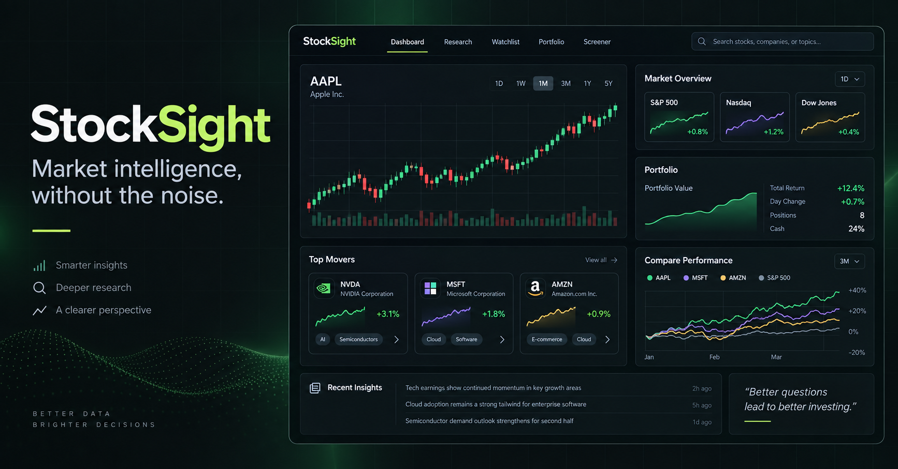

# StockSight

StockSight is a responsive market-research and portfolio workspace built to make price action, technical signals, holdings, and long-term scenarios understandable in one place.



## Highlights

- Live Finnhub quotes with Yahoo Finance historical candles and transparent deterministic demo fallbacks
- Candlestick charts with SMA-50 and SMA-200 overlays and multiple time ranges
- Explainable RSI/SMA/momentum recommendations with visible scoring and signal strength
- Multiple portfolios with fractional shares, average cost, cash, gain/loss, and sector allocation
- Local-first persistence for guests and user-scoped Supabase sync for authenticated users
- Side-by-side comparison of up to three stocks, including normalized return, CAGR, volatility, and drawdown
- Company news, portfolio tables, performance periods, and a contribution-based wealth forecaster
- Keyboard-friendly search, responsive layouts, reduced-motion support, empty states, and explicit live/demo labels

## Architecture

```text
React + TypeScript UI
        │
        ├── SWR quote orchestration ── Finnhub quote/news API
        │                         └── Yahoo Finance historical proxy
        ├── analytics ── SMA / RSI / CAGR / volatility / drawdown
        └── portfolio state
              ├── IndexedDB (all visitors, local-first)
              └── Supabase (authenticated users only, RLS protected)
```

The app keeps guest data on-device. Cloud reads and writes are attempted only when a verified Supabase user ID is present, and the included SQL policies restrict every row to its owner.

## Tech stack

React 18, TypeScript, Vite, Tailwind CSS, SWR, Lightweight Charts, Recharts, Supabase, Finnhub, and Yahoo Finance.

## Run locally

```bash
npm install
copy .env.example .env
npm run dev
```

The app runs at `http://localhost:4000`. Add the relevant keys to `.env`; never commit that file.

```env
VITE_FINNHUB_API_KEY=
VITE_SUPABASE_URL=
VITE_SUPABASE_ANON_KEY=
```

For cloud sync, run `supabase/portfolio_state.sql` in the Supabase SQL editor and enable email authentication. The app remains fully usable through IndexedDB when Supabase is not configured.

## Quality checks

```bash
npm run typecheck
npm test
npm run build
```

Before deploying, run Lighthouse against the production URL and test at 320px, 768px, 1440px, and an ultrawide viewport.

## Data transparency

- A green label means the current quote came from a live provider.
- An amber label means the displayed series is deterministic demonstration data.
- Estimated fundamentals are explicitly marked as illustrative.
- Technical signals require at least 200 real daily sessions; the app does not issue a recommendation from simulated history.
- Forecasts use historical CAGR as a scenario assumption, not a prediction.

## Deployment

Build with `npm run build` and deploy to Vercel. Configure the three environment variables in the host dashboard. The included `api/yahoo-finance/[...path].js` Vercel Function provides the production historical-data proxy; Vite provides the equivalent proxy during local development.

After deployment, replace the relative Open Graph image path in `index.html` with the absolute production URL for the most reliable LinkedIn preview.

## Engineering decisions

- **Graceful degradation:** external data failures never make the dashboard unusable.
- **Honest analytics:** demo series, estimates, and real market inputs are distinguished in the interface.
- **Explainability:** recommendations expose both their indicators and scoring thresholds.
- **Privacy by default:** anonymous portfolio data stays local rather than using a shared backend record.

## Disclaimer

StockSight is an educational software project. It is not financial advice, and its estimates, signals, and forecasts should not be used as the sole basis for an investment decision.
